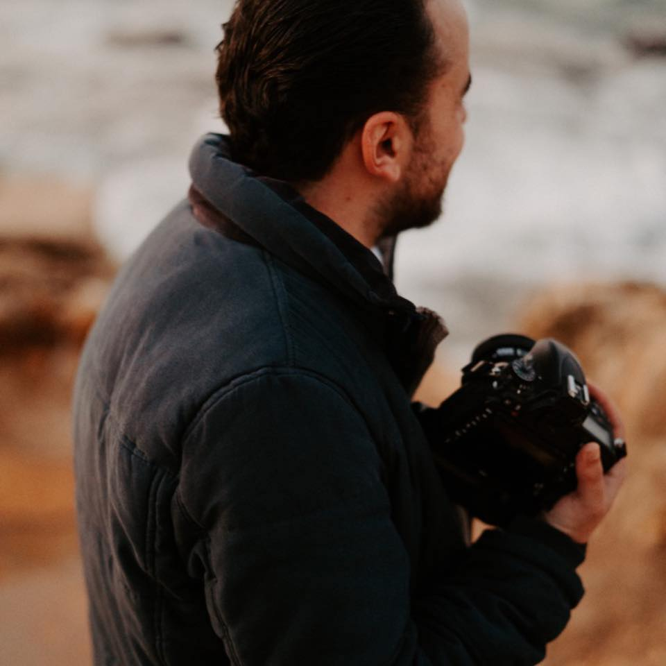

# Bakri Hmouda  

    
    
tel: 71450221   
e-mail: Bakri.Hmouda@gmail.com   
   

photographer with over 14 years of experience in Photography and Digital Design.  
 
      
### Job Experience:
    

  #### 2019 - Current --------------- Freelance Photographer   
  - high quality digital photography for both print and digital use.
  - advance computer processing of images 
  - Planning and preparing for all on-location and studio shoots.
    

#### 2006 - 2019 ----------------- Photographer
**Star Media Studio - Tripoli, Lebanon**
-	Performed advanced computer processing of images for assignments.
-	Selected and set up appropriate props, backdrops and lighting.
-	Planned and prepared for all on-location and studio shoots.
-	Inspected proofs to verify quality of prints and need for adjusting and retouching.
-	Photographed high-quality images for both print and internet distribution.
-	Archived photographs on computers and servers.
-	Completed complex photoshoots involving large-scale performances.
-	Handled social media and Increased customer engagement through social media.
  
 

### Skills

-	Digital Photography
-	Retouching and color correction
-	Equipment setup and maintenance
-	Digital design
-	Problem resolution
-	Adobe Photoshop & Lightroom
-	Social media 

 

### Education

Technical High school Diploma in accounting
Lycée Libanaise - Tripoli, Lebanon - 2009

 

### Languages 

Arabic    ●●●●●●  
English  ●●●●●   
French   ●●   

 

### Personal info 

Birthday: 3-1-1990  
Lebanese personal driving license